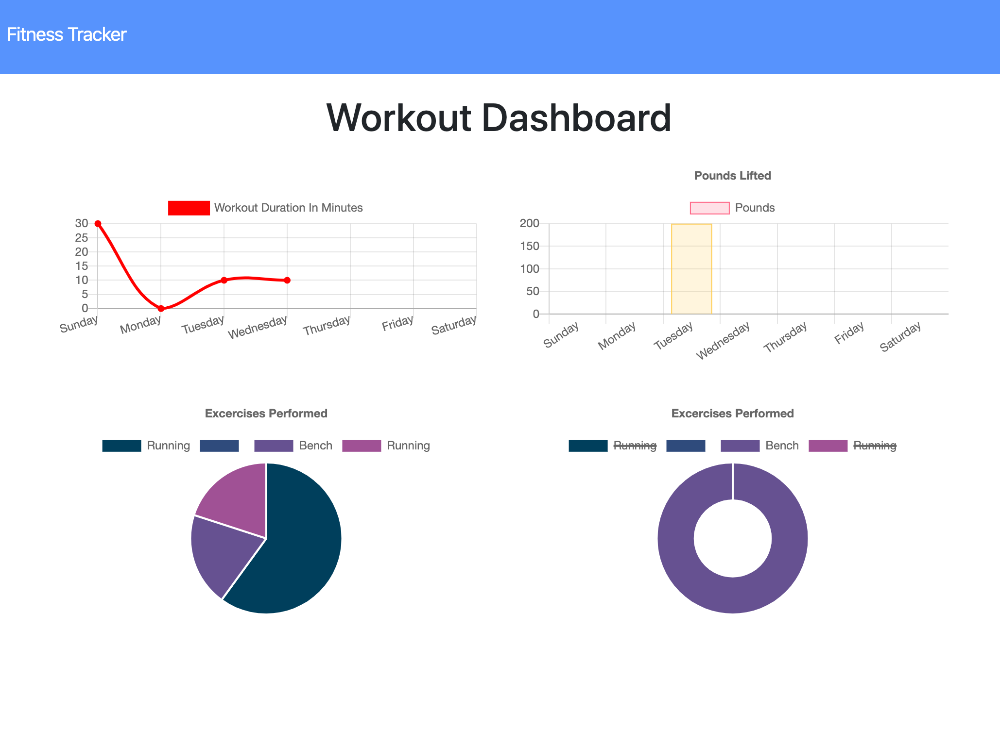

# Workout Tracker

## Description

An app that lets you track your workouts and then displays them on a graph.

## Demo

[Demo](https://enigmatic-ravine-32810.herokuapp.com/)

## Table of Contents

- [Installation](#installation)
- [Usage](#usage)
- [Screen Shots](#screen-shots)
- [License](#license)
- [Contributing](#contributing)
- [Questions](#questions)

## Installation

Install Dependencies

`npm install`

Seed the table by running npm run seed.

## Usage

To start the application, run `npm start`

## Screen Shots

## License

This project is licensed under the MIT License - see the [LICENSE](LICENSE) file for details.

## Contributing

If you want to contribute, open a Pull Request and include a detailed description and screenshots of the changes.

## Questions

If you have any questions about the repo, open an issue [tylorkolbeck](https://github.com/tylorkolbeck).
